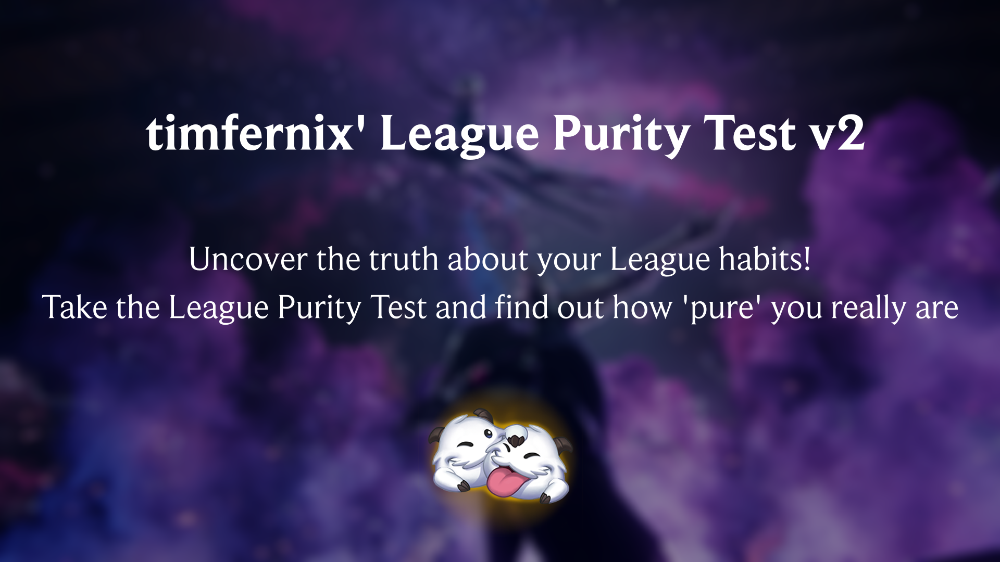

An assessment of your League of Legends gameplay habits and experiences.

### 🔰 **What is the League Purity Test?**

The League Purity Test is a quiz that evaluates your League of Legends gameplay habits, experiences, and opinions. The test is designed to be fun and entertaining, and is not meant to be taken seriously.

### 💻 **How does it work?**

The test consists of a series of questions that you can tick. Your responses will determine your "purity score," which will be displayed at the end of the test.

### ✨ **Features**

* 100+ questions that will put your League of Legends habits and experiences to the test
* A purity score that will let you know just how "pure" you are
* Shareable results so you can compare with friends and brag about your score

### 🛠 **Note**

I am not a good programmer, so i had to make some workarounds. If anyone has any information about the following problems, please let me know and I will revise the code:
- Drawing images on the canvas (with `drawImage()`) doesnt work after one image is set.

### 📢 **Changelog**

| Version | Changes |
|---------|---------|
|         |         |
